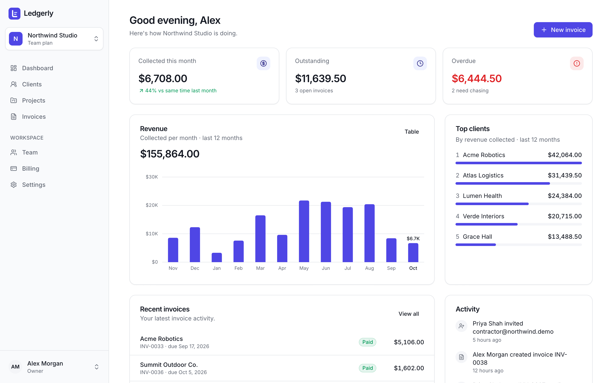
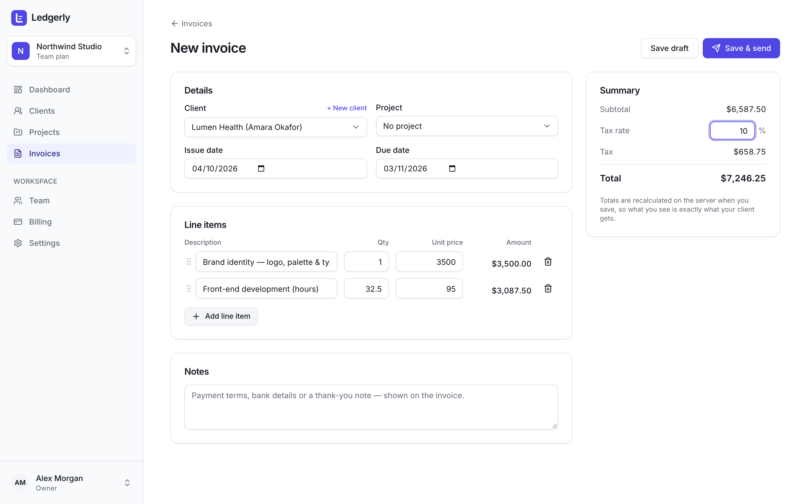
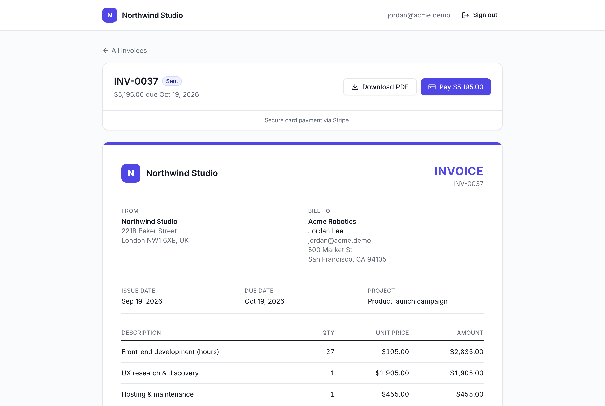
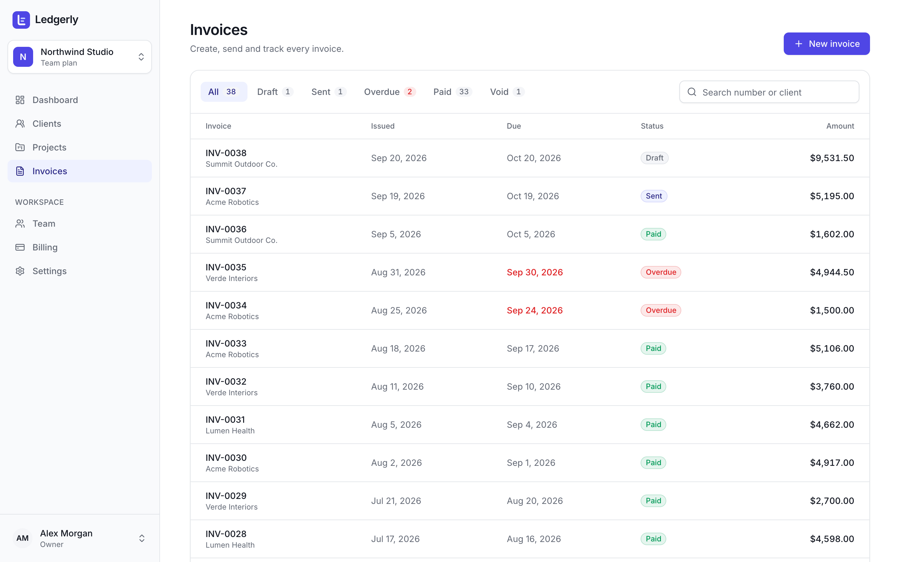
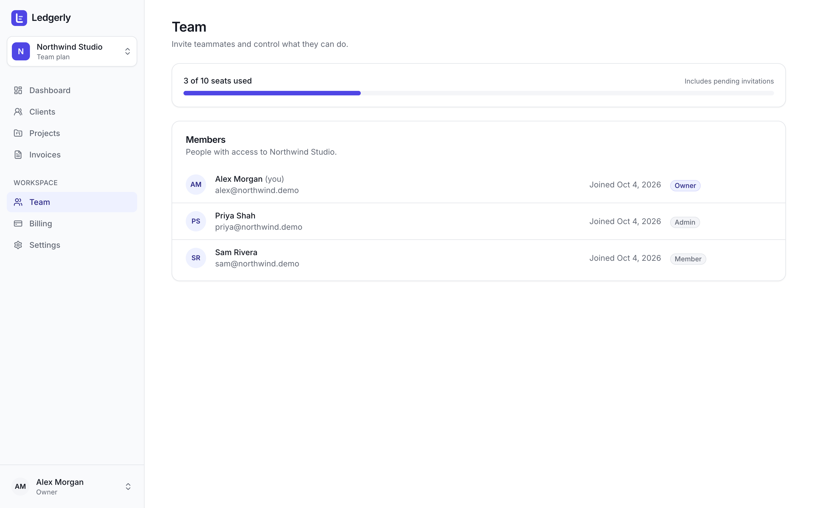

# Ledgerly

**A multi-tenant SaaS for small agencies: client portal, invoicing and Stripe subscriptions.**

Agencies sign up, invite their team, manage clients and projects, and send branded invoices that
clients pay online through a portal. Agencies pay for Ledgerly itself on a Free / Pro / Team
subscription.

**[▶ Live demo: ledgerly-gjtu.onrender.com](https://ledgerly-gjtu.onrender.com/login?demo=1)** · One click, no
sign-up: try it as an agency owner, a team member, or a client paying an invoice. _(Free hosting:
the first load can take ~30 seconds while the server wakes up.)_



[](https://github.com/pranotivarpe/ledgerly/actions/workflows/ci.yml)


---

## What it does

| For agencies                                                    | For their clients                                 |
| --------------------------------------------------------------- | ------------------------------------------------- |
| Organization sign-up, multiple workspaces per user              | Branded portal with passwordless magic-link login |
| Team invites with Owner / Admin / Member roles                  | View invoices and download PDFs                   |
| Clients, projects and budgets                                   | Pay by card through Stripe Checkout               |
| Invoice editor with line items, tax and live totals             | Instant receipt by email                          |
| Branded PDF invoices, emailed with a "View & pay" link          |                                                   |
| Revenue dashboard, top clients and activity feed                |                                                   |
| Automatic overdue reminders                                     |                                                   |
| Stripe subscriptions: Checkout, plan switching, Customer Portal |                                                   |

<table>
  <tr>
    <td></td>
    <td></td>
  </tr>
  <tr>
    <td align="center">Invoice editor with live, server-verified totals</td>
    <td align="center">Client portal: the agency's brand, a one-click pay button</td>
  </tr>
  <tr>
    <td></td>
    <td></td>
  </tr>
  <tr>
    <td align="center">Invoices with status filters, search and pagination</td>
    <td align="center">Team roles and plan-based seat limits</td>
  </tr>
</table>

A [sample PDF invoice](docs/sample-invoice.pdf) is in the repo.

## Live demo

The login page has **one-click demo buttons**. They open a shared sample agency, _Northwind Studio_,
with a year of invoices, payments and activity.

- **Agency owner:** full access; billing and team changes are read-only in the demo
- **Team member:** the same data with Member permissions
- **Client portal:** the client's view, with an open invoice to pay

The demo resets every day. Emails it triggers are captured but never delivered. Sign up to try real
Stripe test-mode checkout (card `4242 4242 4242 4242`, any future date, any CVC).

## Tech stack

| Layer    | Tech                                                                                       |
| -------- | ------------------------------------------------------------------------------------------ |
| Frontend | React 19, Vite, TypeScript, Tailwind CSS v4, shadcn-style UI, TanStack Query, React Router |
| Backend  | Node.js, Express 5, TypeScript, Zod                                                        |
| Database | PostgreSQL (Neon in production), Prisma ORM                                                |
| Payments | Stripe Billing (subscriptions, webhooks, Customer Portal), Stripe Checkout                 |
| Email    | React Email templates, delivered with Resend                                               |
| PDF      | `@react-pdf/renderer` (server-side)                                                        |
| Testing  | Vitest + Supertest (115 API tests), Playwright (end-to-end)                                |
| CI / CD  | GitHub Actions; one Render web service                                                     |

## Architecture

```mermaid
flowchart LR
  subgraph Browser
    A[Agency app<br/>React SPA]
    P[Client portal<br/>React SPA]
  end
  subgraph Server["Express API (same origin, serves the SPA)"]
    AUTH[Auth & sessions]
    T[Tenant scope<br/>forTenant&#40;orgId&#41;]
    R[REST routes]
    J[Jobs<br/>reminders · demo reset]
    WH[Stripe webhooks]
  end
  DB[(PostgreSQL)]
  S[Stripe]
  E[Resend]

  A -- httpOnly cookies --> AUTH
  P -- portal cookie --> AUTH
  AUTH --> R --> T --> DB
  J --> DB
  R -- Checkout / Portal --> S
  S -- signed events --> WH --> DB
  R & J -- PDFs + emails --> E
```



### How the hard parts work

**Tenant isolation.** Every agency shares one database. Each tenant-owned row carries an
`organizationId`. Route handlers never touch the raw Prisma client. They get a tenant-scoped client
([`forTenant()`](apps/api/src/lib/tenant.ts)) that adds the organization to every read, update and
delete, and stamps it on every create, so a forgotten `where` can't leak another agency's data.
Non-members get a 404, not a 403, so organization slugs can't be probed.
[Tests](apps/api/test/tenant-isolation.test.ts) cover this both over HTTP and at the data layer.

**Roles.** One permission map ([`permissions.ts`](apps/api/src/lib/permissions.ts)) is enforced by
middleware on every request. The UI uses the same list only to hide controls. Admins can't touch
owners, and an organization can never lose its last owner.

**Authentication.**

- A 15-minute JWT access token plus a refresh token that is single-use, rotated on every refresh
  and revocable. Both live in httpOnly cookies, and only refresh-token hashes are stored.
- Passwords are hashed with scrypt.
- Requests from other origins are rejected (CSRF defense), auth endpoints are rate-limited, and
  login responses never reveal whether an account exists.

**Client portal.**

- Clients sign in with single-use magic links. The page consumes the link with a POST, never on
  the GET, so corporate email scanners that pre-open links can't burn them.
- Portal sessions use a separate cookie and JWT audience, so agency and client sessions can't be
  swapped.
- Archiving a client revokes their access immediately.

**Money.**

- Amounts are stored as integer cents, and totals are always recomputed on the server.
- Invoice numbers come from an atomic per-organization sequence, which a concurrency test covers.
- Sent invoices can't be edited: to correct one, void it and duplicate it.

**Stripe subscriptions.**

- Webhooks are signature-verified and processed exactly once (`StripeEvent` table).
- Webhooks never trust the event payload: they re-fetch the latest subscription, so out-of-order
  delivery can't corrupt plan state.
- Returning from Checkout also triggers a sync, so the UI doesn't wait on webhook latency.
- `past_due` keeps paid features during Stripe's retry period.
- Downgrades that would exceed the new seat limit are blocked.

**Invoice payments.** Clients pay through Stripe Checkout. The webhook and the return-from-Checkout
confirmation both record the payment, and the unique payment-intent ID makes that exactly-once. The
same applies to the receipt and "you got paid" emails.

**Background jobs.** Overdue reminders go out at most every 3 days and only within 60 days of the
due date. Each invoice is _claimed_ with a conditional update before its email is sent, so several
servers running the job at once can't double-send. The jobs run in-process on a single server, or
through `POST /api/jobs/*` with a bearer secret for external cron.

**Plan limits.** The API enforces seats (pending invites count toward them), active clients and
invoices per month, returning `402 PLAN_LIMIT`. The UI turns that into an upgrade prompt.

**Upgrade path: Stripe Connect.** Client payments currently settle to the platform's Stripe
account. In production each agency would connect its own account through Stripe Connect
(`transfer_data.destination` on the Checkout session) without changing the invoice flow.

## Project structure

```
apps/
  api/                 Express API
    prisma/            schema, migrations, seed entry point
    src/
      routes/          auth, organizations, team, clients, projects, invoices,
                       billing, portal, webhooks, jobs
      services/        billing, invoices, payments, portal, notifications, revenue
      middleware/      auth, tenant, demo guard, origin check
      emails/          React Email templates
      pdf/             invoice PDF document
      jobs/            overdue reminders, scheduler
      demo/            demo workspace seed + reset
    test/              Vitest + Supertest
  web/                 React SPA: marketing site, agency app, client portal
e2e/                   Playwright end-to-end tests
render.yaml            one-service deploy blueprint
```

## Running locally

Requirements: Node.js 20+ and PostgreSQL 14+.

```bash
npm install
cp apps/api/.env.example apps/api/.env      # fill in DATABASE_URL, JWT secrets, Stripe test key
createdb ledgerly && createdb ledgerly_test
npm run db:migrate                          # apply migrations + generate the Prisma client
npm run db:seed                             # demo agency with a year of data
npm run stripe:setup -w apps/api            # create Pro/Team prices + Customer Portal config (idempotent)
npm run dev                                 # API on :4100, web on :5180
```

- **Emails:** without `RESEND_API_KEY`, every email is captured and viewable at
  `http://localhost:5180/api/dev/emails`.
- **Stripe webhooks (optional locally):**
  `stripe listen --forward-to localhost:4100/api/webhooks/stripe`. The app also syncs on return
  from Checkout.
- **Demo logins:** `alex@northwind.demo` (Owner), `priya@northwind.demo` (Admin),
  `sam@northwind.demo` (Member), all with password `demo-password`. The client portal is at
  `/portal/northwind`.

| Command                         | What it does                                    |
| ------------------------------- | ----------------------------------------------- |
| `npm run dev`                   | API + web app with hot reload                   |
| `npm test`                      | API test suite (separate test database)         |
| `npm run test:e2e`              | Playwright end-to-end tests                     |
| `STRIPE_E2E=1 npm run test:e2e` | Also run the real Stripe Checkout test          |
| `npm run typecheck`             | Type-check both apps                            |
| `npm run build`                 | Production build (the API serves the web build) |

## Deployment

One Render web service serves both the API and the built React app from the same origin. That
keeps auth cookies first-party: no third-party-cookie or CORS problems. Postgres runs on Neon.
[`render.yaml`](render.yaml) declares the service. Migrations run on start, and secrets are
generated by Render.

Environment variables to set:

- `DATABASE_URL`
- `WEB_URL` and `API_URL` (both the public URL)
- `STRIPE_SECRET_KEY` and `STRIPE_WEBHOOK_SECRET`
- `RESEND_API_KEY` (optional)

Register `https://<host>/api/webhooks/stripe` in the Stripe Dashboard for these events:
`checkout.session.completed`, `checkout.session.async_payment_succeeded`, `customer.subscription.*`
and `invoice.payment_failed`.
